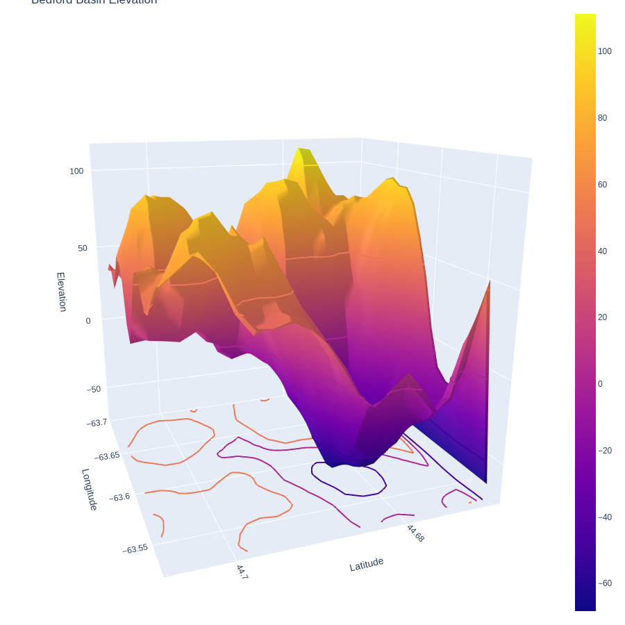

# Bedford Bathymatry using python
```python
import plotly.graph_objects as go
import pandas as pd
import numpy as np
# Read data from a csv
z_data = pd.read_csv('bathy_bedford.csv')
z = z_data.values
sh_0, sh_1 = z.shape
x, y = np.linspace(44.66875, 44.74791667, sh_0), np.linspace(-63.69791667, -63.52708333, sh_1)
fig = go.Figure(data=[go.Surface(z=z, x=x, y=y,colorscale='Viridis')])
"""The 'colorscale' property is a colorscale and may be
    specified as:
      - A list of colors that will be spaced evenly to create the colorscale.
        Many predefined colorscale lists are included in the sequential, diverging,
        and cyclical modules in the plotly.colors package.
      - A list of 2-element lists where the first element is the
        normalized color level value (starting at 0 and ending at 1), 
        and the second item is a valid color string.
        (e.g. [[0, 'green'], [0.5, 'red'], [1.0, 'rgb(0, 0, 255)']])
      - One of the following named colorscales:
            ['aggrnyl', 'agsunset', 'algae', 'amp', 'armyrose', 'balance',
             'blackbody', 'bluered', 'blues', 'blugrn', 'bluyl', 'brbg',
             'brwnyl', 'bugn', 'bupu', 'burg', 'burgyl', 'cividis', 'curl',
             'darkmint', 'deep', 'delta', 'dense', 'earth', 'edge', 'electric',
             'emrld', 'fall', 'geyser', 'gnbu', 'gray', 'greens', 'greys',
             'haline', 'hot', 'hsv', 'ice', 'icefire', 'inferno', 'jet',
             'magenta', 'magma', 'matter', 'mint', 'mrybm', 'mygbm', 'oranges',
             'orrd', 'oryel', 'peach', 'phase', 'picnic', 'pinkyl', 'piyg',
             'plasma', 'plotly3', 'portland', 'prgn', 'pubu', 'pubugn', 'puor',
             'purd', 'purp', 'purples', 'purpor', 'rainbow', 'rdbu', 'rdgy',
             'rdpu', 'rdylbu', 'rdylgn', 'redor', 'reds', 'solar', 'spectral',
             'speed', 'sunset', 'sunsetdark', 'teal', 'tealgrn', 'tealrose',
             'tempo', 'temps', 'thermal', 'tropic', 'turbid', 'twilight',
             'viridis', 'ylgn', 'ylgnbu', 'ylorbr', 'ylorrd'].
        Appending '_r' to a named colorscale reverses it."""
fig.update_traces(contours_z=dict(show=True, usecolormap=True,
                                  highlightcolor="limegreen", project_z=True))
fig.update_layout(title='Bedford Basin Elevation',xaxis_title="Latitude", 
                  yaxis_title="Longitude",autosize=False,
                  width=900, height=900, 
                  margin=dict(l=65, r=50, b=65, t=90))
fig.update_layout(scene = dict(
                    xaxis_title='Latitude',
                    yaxis_title='Longitude',
                    zaxis_title='Elevation'),
                    margin=dict(r=20, b=10, l=10, t=10))  
# fig.update_layout(color='Elevation')
fig.update_layout(coloraxis_colorbar=dict(
    title="Elevation",
    thicknessmode="pixels", thickness=50,
    lenmode="pixels", len=200,
    yanchor="top", y=1,
    ticks="outside", ticksuffix="",
    dtick=5
))
fig.show()
```


